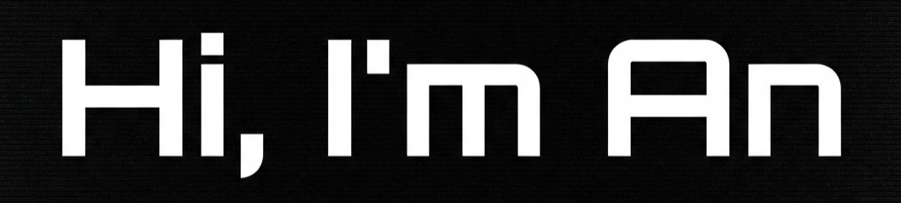

<!-- Header Image -->

# Hi there, I'm An (@umegan) 👋

I am passionate about **Physical AI Robotics Simulation**, working to bridge the gap between virtual training and physical deployment. My focus lies in creating photo-realistic simulations and robust control policies for next-generation robotics.

---

### 🤖 Tech Stack & Tools

| **Languages** | **Robotics & Simulation** | **Tools & Platforms** |
|:---:|:---:|:---:|
|  |  |  |
| |  |  |
| |  | |

---

### 📊 GitHub Stats

---

### 📫 Connect with me

